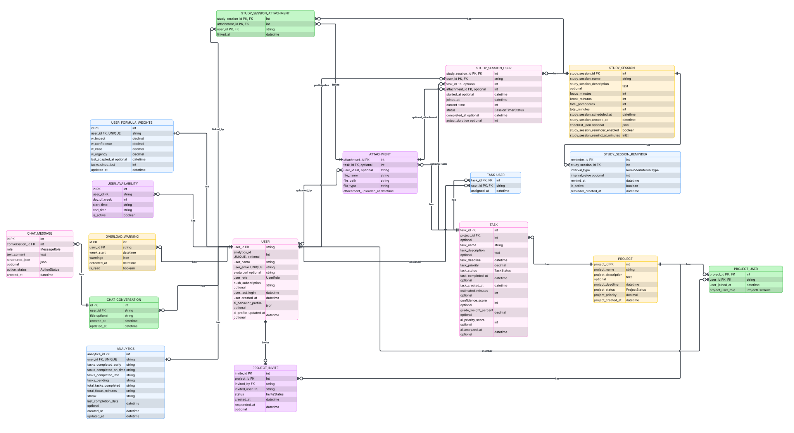

# Final Project – Web Application Development and Security

Course Code: COMP6703001 
Course Name: Web Application Development and Security 
Institution: BINUS University International 

## 1. Project Information

Project Title: Scholar's Plan Site 
Project Domain: Study Planner & Productivity Tracker

Class:
[Class Code] – L4BC

Group Members (Max 3 – same class only):
| Name | Student ID | Role | GitHub Username |
| :--- | :--- | :--- | :--- |
| Barri Nur Pratama | 2802501142 | developer | Barrizzz |
| Kenny Krixiadi | 2802529191 | | |
| Rafie Mustika Ramasna | 2802522815 | | |

---

## 2. Instructor & Repository Access
This repository must be shared with:
* **Instructor:** Ida Bagus Kerthyayana Manuaba 
  * Email: imanuaba@binus.edu 
  * GitHub: bagzcode
* **Instructor Assistant:** Juwono 
  * Email: juwono@binus.edu
  * GitHub: Juwono136
 
---

## 3. Project Overview

### 3.1 Problem Statement
Explain:
* What problem does this application solve?
* Who are the target users?

### 3.2 Solution Overview
Briefly describe:
* Main features
* Why this solution is appropriate
* Where AI is used

---

## 4. Tech Stack

Frontend : Next.js 
Backend : Node.js or Next.js 
API REST : API 
Database : PostgreSQL / Firebase (for auth only) 
Containerization: Docker 
Deployment : University Server 
Version Control : GitHub 

---

## 5. System Architecture

### 5.1 Architecture Diagram

### 5.2 Architecture Explanation

The features of the web app are still in one codebase and uses postgreSQL with PRISMA for backend database handling, hence it makes our website's architecture type: Monolithic.
We are however using external services for our authentication with Firebase auth and we're using an external API for AI features.

---

## 6. API Design (MANDATORY)

### 6.1 API Endpoints
The endpoint list is based on the Swagger comments inside `app/api/**/route.ts` and cross-checked with the route handlers for authentication behavior.

| Method | Endpoint | Description | Auth Required |
| :--- | :--- | :--- | :--- |
| POST | `/api/ai` | Re-run AI analysis for one of the authenticated user's tasks | Yes |
| GET | `/api/ai/overload` | List stored overload warnings for the authenticated user | Yes |
| POST | `/api/ai/overload` | Run overload detection for the authenticated user's week | Yes |
| PATCH | `/api/ai/overload` | Mark an overload warning as read | Yes |
| POST | `/api/ai/schedule` | Generate a proposed study schedule for the authenticated user | Yes |
| PUT | `/api/ai/schedule` | Confirm selected sessions and persist them for the authenticated user | Yes |
| POST | `/api/ai/study-track-draft` | Generate an AI study-track draft for a task | Yes |
| POST | `/api/ai/task-draft` | Generate an AI task draft from text and optional attachments | Yes |
| POST | `/api/ai/weight-adapter` | Adapt priority-formula weights | Yes  |
| GET | `/api/analytics` | Get the current user's analytics | Yes |
| PATCH | `/api/analytics` | Update the current user's analytics | Yes |
| GET | `/api/attachment` | Get a temporary URL for an uploaded file | Yes |
| POST | `/api/attachment` | Upload a standalone attachment | Yes |
| DELETE | `/api/attachment/{id}` | Delete a stored file by file name | Yes |
| POST | `/api/auth/firebase` | Exchange a Firebase ID token for a session cookie | No |
| POST | `/api/auth/logout` | Log out the current user and clear the session cookie | No |
| GET | `/api/chat` | List chat conversations for the authenticated user | Yes |
| POST | `/api/chat` | Send a message to the authenticated AI chat agent | Yes |
| GET | `/api/chat/{conversationId}` | Get a chat conversation and its messages | Yes |
| PATCH | `/api/chat/{conversationId}` | Update a chat message action status | Yes |
| DELETE | `/api/chat/{conversationId}` | Delete a chat conversation | Yes |
| GET | `/api/docs` | Return the generated OpenAPI document | No |
| POST | `/api/docs` | Return the generated OpenAPI document | No |
| GET | `/api/project` | Get projects visible to the authenticated user | Yes |
| POST | `/api/project` | Create a new project owned by the authenticated user | Yes |
| GET | `/api/project/invite` | List pending project invites for the authenticated user | Yes |
| POST | `/api/project/invite` | Invite a user to a project | Yes |
| PATCH | `/api/project/invite/{id}` | Accept or decline a project invitation | Yes |
| POST | `/api/project/task` | Create a new task within a project | Yes |
| PATCH | `/api/project/task/{id}` | Update a project task by ID | Yes |
| DELETE | `/api/project/task/{id}` | Delete a project task by ID | Yes |
| GET | `/api/project/task/{id}/attachment` | List attachments for a project task | Yes |
| POST | `/api/project/task/{id}/attachment` | Upload an attachment for a project task | Yes |
| DELETE | `/api/project/task/{id}/attachment/{attachmentId}` | Delete an attachment from a project task | Yes |
| PATCH | `/api/project/{id}` | Update a project by ID | Yes |
| DELETE | `/api/project/{id}` | Delete a project by ID | Yes |
| POST | `/api/project/{id}/member` | Add a member to a project | Yes |
| PATCH | `/api/project/{id}/member/{memberId}` | Update a member's role in a project | Yes |
| DELETE | `/api/project/{id}/member/{memberId}` | Remove a member from a project | Yes |
| GET | `/api/study` | Get the authenticated user's study sessions | Yes |
| POST | `/api/study` | Create one or more study sessions for the authenticated user | Yes |
| POST | `/api/study/attachment` | Upload an attachment and link it to study sessions | Yes |
| POST | `/api/study/batch` | Create a batch of study sessions for a task | Yes |
| GET | `/api/study/{id}` | Get one study session for the authenticated user | Yes |
| PATCH | `/api/study/{id}` | Update a study session by ID | Yes |
| DELETE | `/api/study/{id}` | Delete a study session by ID | Yes |
| DELETE | `/api/study/{id}/attachment/{attachmentId}` | Unlink and possibly delete a study session attachment | Yes |
| GET | `/api/task` | Get personal tasks belonging to the authenticated user | Yes |
| POST | `/api/task` | Create a new personal task for the authenticated user | Yes |
| GET | `/api/task/{id}` | Get a single authenticated-user task by ID | Yes |
| PATCH | `/api/task/{id}` | Update a task by ID | Yes |
| DELETE | `/api/task/{id}` | Delete a task by ID | Yes |
| GET | `/api/task/{id}/attachment` | List attachments for a task | Yes |
| POST | `/api/task/{id}/attachment` | Upload an attachment for a task | Yes |
| DELETE | `/api/task/{id}/attachment/{attachmentId}` | Delete an attachment from a task | Yes |
| GET | `/api/users` | Get all users using safe public fields | Yes |
| GET | `/api/users/me` | Get the currently authenticated user | Yes |
| PUT | `/api/users/me` | Update the authenticated user's profile | Yes |
| DELETE | `/api/users/me` | Delete the authenticated user's account | Yes |
| POST | `/api/web-push/send` | Send a web-push notification to the authenticated user | Yes |
| POST | `/api/web-push/subscribe` | Register the authenticated user's web-push subscription | Yes |
| DELETE | `/api/web-push/unsubscribe` | Clear the authenticated user's web-push subscription | Yes |

### 6.2 API Documentation
* Swagger UI: `/docs`
* OpenAPI JSON: `/api/docs`
* Public API link: https://app.swaggerhub.com/apis-docs/scholarsplot/Scholars-Plot-Site/1.0.0?view=uiDocs#/
* The OpenAPI document is generated from route-local Swagger comments in `app/api/**/route.ts`.
* Most application endpoints require the httpOnly `session` cookie set by `/api/auth/firebase`.

---

## 7. Database Design

### 7.1 Database Choice
Explain why you chose:
PostgreSQL. We choose this database because it is open source, and a versatile relational database. PostgreSQL is also widely used in many industries as a standard, this would help in us as students to get used to what type of programs are running the tech industry.

### 7.2 Schema / Data Structure

---

## 8. AI Features (MANDATORY)

### 8.1 AI Feature List
| AI Feature | Purpose | AI Type (NLP / OCR / Rec) |
| :--- | :--- | :--- |
| AI task draft suggestions | Used on personal task creation, personal task editing, and project task creation. The user provides a title, description, deadline, priority, and optional supported attachments; Gemini returns a structured draft with title, description, priority, reasoning, and skipped attachment notes. | NLP + multimodal document/image understanding |
| AI study-track draft suggestions | Used on the new study-session planner for an existing task. The app sends the task, study preferences, availability, behavior profile, and task attachments; Gemini returns proposed study-session tracks with dates, times, pomodoro settings, notes, warnings, and reasoning. | Recommendation + NLP |
| Ploty AI chat assistant | Used by the chatbot page/panel. Ploty answers questions about the user's tasks, schedule, projects, and workload, and can return confirmable action cards for task drafts or task-linked study plans. | Conversational NLP + function calling |
| Automatic task analysis and priority support | Triggered by task creation and available through the AI analysis route. The service estimates effort, confidence, grade weight, and an AI priority score that is stored on the task and used by scheduling/chat context. Completing tasks can also trigger priority-formula weight adaptation. | NLP + recommendation |

The codebase also contains backend routes for schedule optimization, overload detection, and weight adaptation. They are documented in the API table, but they are not listed as standalone user-facing frontend features unless a current component directly exposes them.

### 8.2 AI Integration Flow
* Task draft flow: task form input and optional attachments -> `/api/ai/task-draft` -> `generateTaskDraft()` sends validated prompt content and supported files to Gemini -> the frontend shows a preview -> the user applies it before creating or updating the real task.
* Study-track draft flow: selected task -> `/api/ai/study-track-draft` -> the route loads the task, user preferences, availability, behavior profile, and attachments -> Gemini returns one or more study-session plans -> the user applies the plans in the study planner and saves them through `/api/study/batch`.
* Ploty chat flow: chat message -> `/api/chat` -> the server builds live context from tasks, study sessions, projects, overload warnings, preferences, and formula weights -> Gemini either returns a direct answer or calls a draft tool -> the frontend shows text and, when available, an action card that can create a task or study sessions after user confirmation.
* Task analysis flow: task creation -> `runTaskAnalysis()` -> Gemini estimates effort-related fields -> the priority formula calculates `ai_priority_score` -> the task record is updated asynchronously and later used as planning context.
* Safety and failure handling: AI draft inputs are validated with Zod, obvious prompt-injection patterns are blocked before Gemini is called, supported attachments are filtered, Gemini responses must match schemas, and draft calls use a 30-second timeout with a user-facing fallback error.

---

## 9. Security Implementation (MANDATORY)
## Registration Process
### (Frontend)
- User fills in the registration form: `display_name`, `email`, `password`, `password confirmation`
- User clicks **Sign Up**
- Firebase SDK calls the function `createUserWithEmailAndPassword()`
- Firebase creates a new user in the Firebase Auth console and returns a JSON web token
- Frontend makes a `POST` request to `api/auth/firebase` (Note: The token is placed in the `Authorization` header as “Bearer <token>”)

### (API)
- The API extracts the JSON web token from the `Authorization` header
- It calls `adminAuth.verifyIdToken()` to ensure that the token is a valid Firebase user
- The API decodes the token and gets the `uid` and `email`

### (Database Layer)
- The API performs an upsert: it creates a new table row using the Firebase `uid` (which becomes the `user_id`), `user_name`, `user_email`, `avatar_url`, and updates the `user_last_login`

### (API)
- The API creates a session cookie to store the Firebase `idToken` to keep the user logged in
- Lastly, it sends a `200 OK` status to the frontend, along with the newly created database user object

### (Frontend)
- Frontend receives the success response
- User is redirected to the dashboard route
- Because the session cookie is set, the function `getSession()` will recognize that the user has already been authenticated

## Login Process

### (Frontend)
- User fills in email and password of an already authenticated account
- User clicks **Sign In**
- Firebase SDK calls the function `signInWithEmailAndPassword()`
- Firebase validates the credentials
- If found, it will return a JSON web token to the client
- Frontend makes a `POST` request to `api/auth/firebase` (Note: The token is placed in the `Authorization` header as “Bearer <token>”)

### (API)
- The API extracts the string after the word “Bearer”
- It calls `adminAuth.verifyIdToken(idToken)`
- The API validates if the token is expired, does not exist, etc.
- The API decodes the token which returns: `uid`, `email`, `profile picture`

### (Database Layer)
- The API looks at the Prisma database to find a matching email with the token
- If it is found: it will update the `user_last_login` data
- If it is not found: it will create a new table row

### (API)
- The API generates a session cookie to save the `idToken`
- API sends a `200 OK` if the whole process is successful, as well as sending some of the user data to be used for the frontend

### (Frontend)
- User page is redirected to dashboard by using `router.push()`

### Authentication
Our web app handles authentication by keeping it simple and secure with Firebase. When a user logs in or signs up, Firebase handles the heavy lifting of credential validation and hands back a JSON web token. We then pass that token to our API in the `Authorization` header, where we use `adminAuth.verifyIdToken()` to make sure the user is legit. 

From there, we sync with our Prisma database to either update their last login or create a new row. Finally, the API creates a session cookie using Firebase's `createSessionCookie()`, which allows our `getSession()` function to call `verifySessionCookie()` on subsequent requests to keep them securely logged in. It’s a clean loop: authenticate with Firebase, verify at the API, sync with the database, and maintain the session with a secure cookie.

### Authorization
For authorization, we build on our authentication flow to ensure users only access what they are supposed to. Every time a protected route is requested, our API uses `getSession()` to run `verifySessionCookie()`, confirming the user is still valid. Once authenticated, we use the `uid` from that session to fetch the user’s specific roles or permissions from our Prisma database. We then compare those permissions against the requirements for the requested resource; if the user doesn’t have the necessary access, the API blocks the request with a `403 Forbidden` status.

### Input validation
To ensure data integrity and security, our web app uses Zod validation schemas for all incoming requests. This approach guarantees that the input provided by the user is correctly formatted, type-safe, and sanitized before it ever reaches our business logic or database layer. By enforcing these strict schema definitions at the API entry point, we can prevent malicious data from processing, ensuring a reliable and secure user experience.
  
### Protection against: SQL/NoSQL Injection, XSS, and CSRF
#### Security: Injection Protection
To keep our data safe from SQL and NoSQL injection attacks, we rely on **Prisma ORM** as our primary line of defense. By using Prisma’s parameterized queries, we ensure that user input is never executed as code; instead, it is treated strictly as data parameters, which effectively neutralizes injection attempts at the database driver level. Furthermore, our strict **Zod validation schemas** act as a critical gatekeeper, ensuring that any input reaching the database layer is already type-checked, sanitized, and stripped of unexpected characters or structures before it is ever processed.

#### XSS
For XSS, same as protection against SQL/NoSQL injection, we rely on the **Zod validation schemas** in sanitizing incoming data, as well as ensuring that the user requests is never treated as executable code.

#### CSRF
We defend against CSRF by making use of the proxy.ts (middleware). The proxy will check the CORS domain list and blocks any other unauthorized domains which tries to get resources and running malicious scripts.

### Secure API key handling
We kept our secret API keys in environment variables, making sure that it is in the gitignore file, this ensures that our secrets is not pushed to the github repo which lives in the public internet. For cicd deployment process, we added our API keys in github secrets, in order for the automatic github actions to be able to run smoothly and securely.

---

## 10. Testing Documentation (VERY IMPORTANT)

### 10.1 Frontend Testing
| Test Case | Scenario | Expected Result | Status |
| :--- | :--- | :--- | :--- |
| FE-01 | Analytics page rendering and data states | Analytics cards, charts, and mocked data states render correctly; 3/3 assertions passed | Pass |
| FE-02 | Calendar page schedule display | Calendar renders study-session dates and interactions from mocked data; 5/5 assertions passed | Pass |
| FE-03 | Dashboard page composition | Dashboard loads the expected widgets; 1/1 assertion passed | Pass |
| FE-04 | Projects page workflows | Project, task, member, and dialog UI workflows behave as expected; 8/8 assertions passed | Pass |
| FE-05 | Settings page rendering | Settings sections and user controls render correctly; 3/3 assertions passed | Pass |
| FE-06 | Study edit page legacy coverage | Existing study edit form behavior passes legacy JSX test coverage; 2/2 assertions passed | Pass |
| FE-07 | Study edit page TypeScript coverage | Study edit form state, validation, and update behavior pass current test coverage; 4/4 assertions passed | Pass |
| FE-08 | Study detail page legacy coverage | Existing study detail view renders expected data; 1/1 assertion passed | Pass |
| FE-09 | Study detail page TypeScript coverage | Study detail interactions and data display pass current test coverage; 9/9 assertions passed | Pass |
| FE-10 | New study-session planner | Planner form, draft application, validation, and save behavior pass; 7/7 assertions passed | Pass |
| FE-11 | Study session listing page | Study session list renders expected session data; 2/2 assertions passed | Pass |
| FE-12 | Quick timer completion behavior | Timer should show completed status and trigger success toast when total session time ends; 4/5 assertions passed and completion-status assertion failed | Fail |
| FE-13 | Task detail page | Task detail view renders and handles expected task state; 4/4 assertions passed | Pass |
| FE-14 | New task page | Task form validation, attachment handling, AI suggestion preview, and submit flow pass; 10/10 assertions passed | Pass |
| FE-15 | Login page | Login form validation and Firebase sign-in states pass; 8/8 assertions passed | Pass |
| FE-16 | Register page | Registration form validation and Firebase account creation states pass; 10/10 assertions passed | Pass |
| FE-17 | Register verification page | Email verification flow and user feedback states pass; 7/7 assertions passed | Pass |
| FE-18 | Logout button component | Logout button calls the logout flow correctly; 1/1 assertion passed | Pass |
| FE-19 | Chat action card component | Confirm and dismiss behavior for chat action cards passes; 2/2 assertions passed | Pass |
| FE-20 | Today's tasks dashboard component | Today's tasks widget renders expected task data; 1/1 assertion passed | Pass |
| FE-21 | Upcoming deadlines dashboard component | Upcoming deadlines widget renders sorted deadline data; 3/3 assertions passed | Pass |
| FE-22 | Sidebar layout component | Sidebar navigation and active states render correctly; 2/2 assertions passed | Pass |
| FE-23 | Notification panel component | Notification panel state and display behavior pass; 3/3 assertions passed | Pass |
| FE-24 | Profile display-name form | Profile name form validation and save behavior pass; 3/3 assertions passed | Pass |
| FE-25 | Study reminders component | Reminder controls render and update as expected; 3/3 assertions passed | Pass |
| FE-26 | Task in-progress button component | Task status button behavior passes; 2/2 assertions passed | Pass |
| FE-27 | Tasks toolbar component | Filtering/search toolbar behavior passes; 2/2 assertions passed | Pass |
| FE-28 | Chatbot component | Chat panel conversation loading and message behavior pass; 3/3 assertions passed | Pass |

### 10.2 Backend & API Testing
| Test Case | Endpoint | Input | Expected Output | Status |
| :--- | :--- | :--- | :--- | :--- |
| API-01 | `/api/ai/overload` | Authenticated overload run, list request, and mark-read request | Overload warning operations return the expected scoped responses; 5/5 assertions passed | Pass |
| API-02 | `/api/ai/schedule` | Authenticated schedule generation and confirmation payloads | Schedule proposal and confirmation are scoped to the session user; 4/4 assertions passed | Pass |
| API-03 | `/api/ai/study-track-draft` | Authenticated task ID for study-track draft generation | Study-track draft route validates task access and returns expected JSON/errors; 3/3 assertions passed | Pass |
| API-04 | `/api/ai/task-draft` | Multipart task draft input with text and optional file | Task draft route uploads supported files and returns expected draft/error JSON; 3/3 assertions passed | Pass |
| API-05 | `/api/ai/weight-adapter` | Session request and cron-secret batch request | Weight adaptation handles authenticated and cron-protected paths; 4/4 assertions passed | Pass |
| API-06 | `/api/auth/firebase` | Firebase ID token login payload | Session cookie is created and user record is synchronized; 1/1 assertion passed | Pass |
| API-07 | `/api/auth/logout` | Logout request | Session cookie is cleared; 1/1 assertion passed | Pass |
| API-08 | `/api/chat/{conversationId}` | Conversation ID plus message action update/delete requests | Conversation reads, deletes, and action-status updates are session scoped; 5/5 assertions passed | Pass |
| API-09 | `/api/chat` | Chat message payload and optional conversation ID | Chat creates or continues a conversation without trusting client user IDs; 4/4 assertions passed | Pass |
| API-10 | Project API client helper | Project API success and failure responses | Client helper normalizes project responses and errors; 7/7 assertions passed | Pass |
| API-11 | `/api/project/invite` | Project invite creation/listing payloads | Invite route validates ownership and invitee state; 4/4 assertions passed | Pass |
| API-12 | `/api/project` | Project create/list payloads | Project route creates and lists session-visible projects correctly; 4/4 assertions passed | Pass |
| API-13 | `/api/project/task/{id}/attachment` | Project task attachment upload/list request | Attachment route enforces project task access; 1/1 assertion passed | Pass |
| API-14 | `/api/project/task/{id}` | Project task update/delete request | Project task mutation is authorized and validated; 1/1 assertion passed | Pass |
| API-15 | `/api/project/task` | Project task creation payload | Project task create route validates and persists expected data; 1/1 assertion passed | Pass |
| API-16 | `/api/study/attachment` | Study attachment multipart upload payload | Attachment is uploaded and linked only to valid study sessions; 3/3 assertions passed | Pass |
| API-17 | `/api/study/batch` | Task-linked batch study-session plans | Batch route creates valid study sessions and rejects invalid plans; 5/5 assertions passed | Pass |
| API-18 | `/api/study` | Study-session create/list payloads | Study sessions are created and listed for the authenticated user; 4/4 assertions passed | Pass |
| API-19 | `/api/task/{id}/attachment` | Task attachment upload/list request | Attachment route enforces task ownership; 1/1 assertion passed | Pass |
| API-20 | `/api/task/{id}` | Task read/update/delete request | Task route validates IDs, authorization, update fields, and delete behavior; 6/6 assertions passed | Pass |
| API-21 | `/api/task` | Personal task create/list payload | Task route creates personal tasks and triggers expected service calls; 1/1 assertion passed | Pass |
| API-22 | `/api/users/me` | Profile read/update/delete payloads | User profile route returns, updates, and deletes only the session user; 4/4 assertions passed | Pass |
| API-23 | `/api/web-push/send` | Authenticated notification send payload | Web-push send route handles success, stale subscriptions, and auth checks; 5/5 assertions passed | Pass |
| API-24 | Backend module: chat agent | Chat prompt, context, and draft-tool calls | Chat agent returns text or confirmable actions as expected; 4/4 assertions passed | Pass |
| API-25 | Backend module: overload detector | Weekly scheduled sessions and unscheduled tasks | Detector returns expected overload severity and fallback behavior; 16/16 assertions passed | Pass |
| API-26 | Backend module: schedule optimizer | Pending tasks, availability, and study preferences | Optimizer generates schedule-shaped output and handles edge cases; 16/16 assertions passed | Pass |
| API-27 | Backend module: weight adapter | Completed-task history and current formula weights | Adapter updates, clamps, or preserves weights correctly; 18/18 assertions passed | Pass |
| API-28 | Backend module: B2 bucket storage | Upload, signed URL, and delete storage inputs | Storage helper calls B2-compatible APIs correctly; 3/3 assertions passed | Pass |
| API-29 | Backend module: crypto helpers | Plain numeric analytics values | Encryption/decryption helpers preserve metric values; 7/7 assertions passed | Pass |
| API-30 | Backend module: AI service | Draft, attachment, prompt-safety, and timeout inputs | AI service validates outputs and returns expected draft/error behavior; 9/9 assertions passed | Pass |
| API-31 | Backend module: project service | Project, member, invite, and task service inputs | Project service enforces ownership and returns expected records/errors; 13/13 assertions passed | Pass |
| API-32 | Backend module: study session service | Study-session create/update/delete and repeat inputs | Study service persists sessions, repeats, reminders, and membership correctly; 16/16 assertions passed | Pass |
| API-33 | Backend module: task service | Task create/update/delete service inputs | Task service serializes and mutates task data correctly; 4/4 assertions passed | Pass |
| API-34 | Backend module: task status analytics | Task completion timing inputs | Analytics counters update for early/on-time/late completions; 3/3 assertions passed | Pass |
| API-35 | Backend module: user service | User profile and public-user service inputs | User service returns safe user data and profile operations correctly; 4/4 assertions passed | Pass |

### 10.3 Security Testing
| Test Case | Attack Type | Expected Behavior | Result |
| :--- | :--- | :--- | :--- |
| SEC-01 | Unauthenticated API access | Protected endpoints return 401 when the session cookie is missing or invalid | Covered by route tests |
| SEC-02 | Broken object-level authorization | User-supplied IDs do not override the authenticated session user; users can only access their own tasks, study sessions, analytics, notifications, and permitted project resources | Covered by route/service tests |
| SEC-03 | Invalid or malicious request body | Zod validation rejects malformed JSON, invalid enum values, invalid IDs, and out-of-range fields before database writes | Covered by route/service tests |
| SEC-04 | File upload abuse | Oversized files are rejected and attachment access/deletion is checked against task, project, or study-session ownership | Covered by route/storage tests |
| SEC-05 | Session lifecycle abuse | Login exchanges a Firebase ID token for an httpOnly session cookie, logout clears it, and account deletion clears both database and session state | Covered by auth route tests |
| SEC-06 | Sensitive analytics data exposure | Analytics numeric counters are encrypted at rest and decrypted only through authenticated service calls | Covered by crypto/service tests |

### 10.4 AI Functionality Testing (MANDATORY)
This subsection is intentionally left for the contributor handling AI functionality testing.

**AI Feature: Schedule Optimizer**

| Test Case | Input | Expected Output | Status |
| :--- | :--- | :--- | :--- |
| AI-01 | Valid availability + tasks, Gemini returns well-formed sessions | `proposed_sessions` array populated with correct structure; `total_scheduled_minutes` and `total_available_minutes` > 0 | Pass |
| AI-02 | Valid input with a `behavior_profile` object supplied | Gemini called once; profile influences prompt without breaking output shape | Pass |
| AI-03 | Empty `tasks` array | Returns empty `proposed_sessions`, `total_scheduled_minutes` = 0 | Pass |
| AI-04 | Empty `availability` array | Returns empty `proposed_sessions` | Pass |
| AI-05 | Gemini returns a session referencing a `task_id` not present in input (`999`) | Ghost session filtered out; only valid task IDs remain | Pass |
| AI-06 | Gemini returns a session with `total_minutes: 0` | Zero-minute session filtered out of result | Pass |
| AI-07 | Gemini returns a session with `scheduled_at: null` | Session missing a schedule time filtered out | Pass |
| AI-08 | Single task with deadline only 2 hours away | Function resolves without crashing; sessions array length ≥ 0 | Pass |
| AI-09 | Gemini call rejects with a network error | Function throws | Pass |
| AI-10 | Gemini returns malformed JSON string | Function throws | Pass |
| AI-11 | Gemini response missing `proposed_sessions` field entirely | Falls back to empty array via `?? []`; `warnings` defaults to `[]` | Pass |
| AI-12 | Gemini returns valid but empty `proposed_sessions` array | Returns empty sessions array gracefully | Pass |
| AI-13 | Task name containing prompt-injection text (e.g. "Ignore previous instructions...") | Function does not crash; output still validated against schema | Pass |
| AI-14 | Task with an extreme `project_priority` value (999999) | Function does not crash; sessions array still returned | Pass |
| AI-15 | Gemini response contains unexpected top-level keys (`hacked`, `admin_override`) | Extra keys stripped from result; not present on returned object | Pass |

**Failure Handling:** If Gemini is unavailable or returns malformed/non-JSON output, `optimizeSchedule` throws rather than silently returning bad data, allowing the calling route to catch the error and surface a controlled failure response. Sessions referencing unknown task IDs, missing schedule times, or zero-minute durations are filtered out before being returned, so a partially malformed Gemini response degrades gracefully instead of corrupting the schedule.

**AI Feature: Overload Detector**

| Test Case | Input | Expected Output | Status |
| :--- | :--- | :--- | :--- |
| AI-01 | Light schedule (1 session, 480 min available) | `overload_detected: false`, `severity: "none"`, arrays present | Pass |
| AI-02 | Heavily overbooked schedule (3 sessions totalling 900 min vs 240 available) | `overload_detected: true`, `severity: "critical"`, `at_risk_tasks` and `warnings` populated | Pass |
| AI-03 | Schedule with one at-risk task | `at_risk_tasks[0]` contains `task_id`, `task_name`, `risk_level`, `reason`, `recommendation` | Pass |
| AI-04 | Empty `scheduled_sessions` and empty `unscheduled_tasks` | `overload_detected: false`, `at_risk_tasks` length 0 | Pass |
| AI-05 | `total_available_minutes: 0` | Function resolves without crashing; `overload_detected` is boolean | Pass |
| AI-06 | Each of the five valid severity values (`critical`, `high`, `medium`, `low`, `none`) | Returned `severity` matches the value Gemini supplied for each case | Pass |
| AI-07 | 20 sessions scheduled within the same week | Function resolves; `severity` reflects dense schedule | Pass |
| AI-08 | Unscheduled task with `estimated_minutes: null` | Function resolves without crashing | Pass |
| AI-09 | Session with no linked task (`task_id` and `task_name` both null) | Function resolves without crashing | Pass |
| AI-10 | Gemini call rejects with a network error | Function throws | Pass |
| AI-11 | Gemini returns completely invalid (non-JSON) text | Function throws | Pass |
| AI-12 | Gemini response missing `overload_detected` and `severity` fields | Falls back to `false` and `"none"` respectively via nullish coalescing; `at_risk_tasks` defaults to `[]` | Pass |
| AI-13 | Gemini call rejects simulating a timeout | Function throws with the timeout error message | Pass |
| AI-14 | Session `task_name` containing a prompt-injection instruction | Function does not crash; `overload_detected` still a boolean | Pass |
| AI-15 | Gemini response contains injected extra fields (`injected_field`, `admin_mode`) | Extra fields stripped from result; not present on returned object | Pass |
| AI-16 | Session `task_name` that is 5000 characters long | Function resolves without crashing | Pass |

**Failure Handling:** Network errors and timeouts from Gemini are allowed to propagate as thrown exceptions rather than being swallowed, so the calling layer (the cron job or API route) can decide how to handle the failure — for example, skipping that user for the current run via `Promise.allSettled` rather than failing the entire batch. Missing fields in an otherwise-valid JSON response fall back to safe defaults (`overload_detected: false`, `severity: "none"`) instead of crashing or reporting a false overload.

**AI Feature: Weight Adapter**

| Test Case | Input | Expected Output | Status |
| :--- | :--- | :--- | :--- |
| AI-01 | 5 completed tasks, valid Gemini response | Result contains `w_impact`, `w_ease`, `w_urgency`, `behavior_profile`, `reasoning`, `adjustment_magnitude` | Pass |
| AI-02 | 8 completed tasks, Gemini suggests weights within range | All three weights fall within the absolute bound 0.5–8.0 | Pass |
| AI-03 | 10 completed tasks, Gemini returns a full `behavior_profile` | Profile object contains all five expected keys | Pass |
| AI-04 | Fewer than 3 completed tasks (2 tasks) | Gemini is never called; weights returned unchanged from current; `adjustment_magnitude: "conservative"` | Pass |
| AI-05 | 5 tasks (conservative band), Gemini suggests an extreme shift (8.0 / 1.0 / 9.0) | Adjustment clamped to ±0.5 from current weights; `adjustment_magnitude: "conservative"` | Pass |
| AI-06 | 10 tasks (moderate band), Gemini suggests extreme shift | Adjustment clamped to ±1.0 from current weights; `adjustment_magnitude: "moderate"` | Pass |
| AI-07 | 20 tasks (full band), Gemini suggests +2.0 shift on `w_urgency` | Adjustment allowed up to ±2.0; `adjustment_magnitude: "full"` | Pass |
| AI-08 | `actual_minutes` exactly equal to `estimated_minutes` (perfect estimation accuracy) | Function resolves; weight values are numeric | Pass |
| AI-09 | `actual_minutes` and `estimated_minutes` both null (session never started) | Function resolves without crashing | Pass |
| AI-10 | Exactly 3 completed tasks (minimum threshold for conservative mode) | Gemini is called exactly once; result is defined | Pass |
| AI-11 | Non-default starting weights (already-adapted user) | Deviation clamp is calculated from the custom current weights, not from defaults | Pass |
| AI-12 | Gemini call rejects with a network error | Function throws | Pass |
| AI-13 | Gemini returns non-JSON text | Function throws | Pass |
| AI-14 | Gemini response missing weight fields entirely | Falls back to current weights via nullish coalescing | Pass |
| AI-15 | Gemini returns weights as numeric strings instead of numbers | `clampWeight` coercion prevents NaN in any returned weight | Pass |
| AI-16 | Completed task `task_name` containing a prompt-injection instruction | Function does not crash; weights remain numeric (no NaN) | Pass |
| AI-17 | Gemini response simulating an injected override (`w_impact: 100`, `w_ease: -50`, `w_urgency: 999`) | All weights clamped to ±0.5 conservative deviation and within absolute 0.5–8.0 bounds regardless of Gemini's claim | Pass |
| AI-18 | Completed task `task_name` is itself a raw JSON payload | Function does not crash; `w_impact` remains a number | Pass |

**Failure Handling:** Below the 3-task threshold, Gemini is skipped entirely and the current weights are returned untouched — this is a deliberate cost and stability control, not a failure path. Above the threshold, every weight returned by Gemini is run through `clampWeight()`, which bounds the value against the *current* weights (not hardcoded defaults) within a tier-specific deviation band, and then against the absolute 0.5–8.0 range. This means even an adversarial or malformed Gemini response (extreme values, negative numbers, numeric strings) can never push a weight outside safe bounds or produce `NaN`.

**AI Feature: AI Chat Agent**

| Test Case | Input | Expected Output | Status |
| :--- | :--- | :--- | :--- |
| AI-01 | User message with no matching function call from Gemini | Returns `{ text, action: null, rawResponse }`; tool config sent with `mode: "AUTO"` and no `allowedFunctionNames` restriction; draft generators not called | Pass |
| AI-02 | Gemini calls `create_task_draft` with title/description/deadline/priority | `generateTaskDraft` called with parsed `Date` deadline; result `action.type` is `CREATE_TASK_DRAFT` with drafted payload; response text contains "drafted a task" | Pass |
| AI-03 | Gemini calls `create_study_track_draft` with a valid `task_id` (42) that exists in context | `generateStudyTrackDraft` called with matched task, preferences, availability, and behavior profile; `action.type` is `CREATE_STUDY_TRACK_DRAFT` with `client_plan_id` generated per plan | Pass |
| AI-04 | Gemini calls `create_study_track_draft` referencing an unknown `task_id` (999, not in pending tasks) | `generateStudyTrackDraft` is never called; `action` is `null`; response text asks "which task" for clarification | Pass |

**Failure Handling:** When Gemini's function call references a `task_id` that doesn't exist in the injected `ChatContext`, the agent does not blindly pass that ID downstream to the draft generator — it short-circuits, skips the Gemini-backed draft call entirely, and returns a clarifying question instead. This protects against both a hallucinated task ID and a deliberately injected one, since the only valid task IDs the agent will act on are the ones it was explicitly given in context.

---

## 11. Deployment & Production Setup

### 11.1 Docker Setup
* Dockerfile included 
* docker-compose.yml included

### 11.2 Production Environment
* Environment variables: 
The application utilizes environment variables to protect secrets such as API keys, database url, and sensitive credentials. We separated the development environment with the production, creating a .env and a .env.production files.
* Secrets handling: 
To handle all the secret variables, we implement .gitignore to make sure that any .env* files are not pushed into the internet. We also placed our variables inside github secrets in order to enable github to get the variables it needs to run the cicd (auto deployment).
* HTTPS configuration: 
The live deployed web application is served on an HTTPS server. The SSL certificates of this server are managed by cloudflare.

### 11.3 Live Application URL
https://e2526-wads-b4bc-05.csbihub.id

---

## 12. GitHub Contribution Summary (INDIVIDUAL)
### Student Name: Barri Nur Pratama
Features implemented: 
Study session, timer, notification, analytics

API endpoints handled: 
- /api/study
- /api/study/[id]
- /api/users
- /api/users/me
- /api/web-push/send
- /api/web-push/subscribe
- /api/web-push/unsubscribe
- /api/auth/firebase
- /api/auth/logout
  
Tests written: 
- /app/analytics
- /app/calendar
- /app/settings
- /app/study
- /app/study/quicktimer
- /app/study/[id]

Security work: 
- Authentication and Authorization (session management & timeout control)
- Encryption of analytcs data
- Protection of notification endpoints

AI-related work: 
- Chatbot frontend UI

### Student Name: Kenny Krixiadi
Features implemented: 
Project, AI

API endpoints handled: 
- /api/project
- /api/project/[id]
- /api/project/[id]/member
- /api/project/[id]/member/[memberId]
- /api/ai
- /api/ai/overload
- /api/ai/schedule
- /api/ai/weight-adapter
- /api/chat
- /api/chat/[conversationId]

Tests written: 
- /lib/ai
- /lib/services

Security work: 
- SQL injection
- Prompt injection

AI-related work: 
- Schedule Optimization
- Overload Dectection
- Weight Adapter + formula weights

### Student Name: Rafie Mustika Ramasna
Features implemented: 
Task, Project, Attachment, AI suggestion, Study Session

API endpoints handled: 
- /api/task/*
- /api/study/batch
- /api/study/attachment
- /api/docs
- /api/ai/study-track-draft
- /api/ai/task-draft

Tests written: 
- /app/tasks
- /lib/bucket.test.ts
- /lib/services
- /app/dashboard
- /app/projects
- /app/calendar

Security work: 
- Prompt Injection Protection

AI-related work: 
- AI Prompts for drafting study session + task
- Generate content with Gemini to schema
- Task + Study Session suggestion AI integration

---

## 13. AI Usage Disclosure (MANDATORY)
List:
AI tools used: Gemini, Claude, ChatGPT 
Purpose of usage: 
The purpose of using AI in our project is to accelerate the development cycle, making use of AI in repetitive structural tasks that would normally take hours to finish, but with the help of AI it could be way faster. AI is handling the scaffholding of our application, while we as the developers are solving the high-level business logic while making sure the quality and security of our application is meeting the standards.

Which parts were assisted:
 - Boilerplate UI design
 - Connecting parts of the frontend with the backend
 - Visualization of frontend code using claude
 - Give the basic structure of API design
 - Assisting in creation of zod schemas
 - Giving suggestions on the tests in jest testing
 - Mapping out the swagger
 - Converting code to tables for README

---

## 14. Known Limitations & Future Improvements
Current limitations: 
- Push notifications does not appear when you close the web app
- There is not much things you can change in settings

Possible future enhancements: 
- Improve the settings page to add more personalization
- Implement outside app notifications
- Clean up project section

AI limitations and risks: 
- Unable to modify or delete tasks/study sessions (create only)

---

## 15. Final Declaration
We declare that:
* This project is our own work
* AI usage is disclosed honestly
* All group members understand the system

**Signed by Group Members:**
* Barri Nur Pratama
* Kenny Krixiadi
* Rafie Mustika Ramasna

## 16. SETUP
Setting up this automated deployment pipeline requires configuring four local configuration files, preparing your remote server, and linking them together via a GitHub Actions self-hosted runner.
 
### 1. Required Configuration Files
#### First we need to have these files in the github repository:
- **`.github/workflows/cicd.yml:`** The automated blueprint that coordinates the CI/CD pipeline stages (linting, testing, building, and deploying). It handles the trigger rules and specifies which jobs execute on the GitHub action runners.
- **`Dockerfile`:** A multi-stage Dockerfile that manages our application's environments. It compiles project dependencies, initializes essential build arguments, runs a database migrator step, and defines the lightweight production runtime environment.
- **`docker-compose.yml`:** The configuration file that manages our containers on the target server. It opens network ports (routing traffic to port `3026,` since this is our assigned port), references environment variables, and isolates application runtime layers from database migration states using custom profiles.
- **`.dockerignore`:** Explicitly prevents build overhead and security leaks by ensuring local files like `node_modules`, `.next`, source code test directories, and local `.env` files are not sent to the Docker daemon.
- **`.env.production`:** A file that holds our production secrets (database credentials, Firebase private keys, api endpoints, etc.). This file is **never** committed to Git for security purposes. Instead, it is dynamically generated on the server by the runner during a deployment run.

---

## 17. DEPLOYMENT INSTRUCTIONS
Before the GitHub Actions runner can fully automate your deployments, you must manually log into your production server and prepare the environment. This setup involves prepping the folder structure, verifying system access, and registering the runner application with GitHub.

### SSH Remote Connection
Connect to the secure server using the environment terminal (configured through the Cloudflare Access portal gateway)

### Step 2: Configure & Enable Rootless Docker
#### 1. Initialize rootless Docker setup script
dockerd-rootless-setuptool.sh install

#### 2. Reload and re-execute the user system daemon
systemctl --user daemon-reexec
systemctl --user daemon-reload

#### 3. Enable and start the user-level Docker service
systemctl --user enable --now docker.service

#### 4. Verify Docker engine is running and fully accessible
docker ps

### Step 3: Install & Start the GitHub Actions Self-Hosted Runner
#### 1. Create a dedicated workspace directory and download the runner package
mkdir actions-runner && cd actions-runner
curl -o actions-runner-linux-x64-2.324.0.tar.gz -L [https://github.com/actions/runner/releases/download/v2.324.0/actions-runner-linux-x64-2.324.0.tar.gz](https://github.com/actions/runner/releases/download/v2.324.0/actions-runner-linux-x64-2.324.0.tar.gz)

#### 2. Unpack the compressed binaries
tar xzf ./actions-runner-linux-x64-2.324.0.tar.gz

#### 3. Register the runner against your repository using your GitHub configuration token
./config.sh --url [https://github.com/your-username/your-repo](https://github.com/your-username/your-repo) --token YOUR_GITHUB_RUNNER_TOKEN

#### 4. Install and launch the runner to run persistently as a system background service
sudo ./svc.sh install
sudo ./svc.sh start
 
Verify that the runner status turns Idle (Green) under your GitHub Repository Settings → Actions → Runners.

### Step 4: Running the runner
Lastly, push the code to `main` or any other branch that is set in the cicd, and the github runner will make a temporary .env.production in the server by looking at the github secrets and it will automatically deploy your latest commit.

